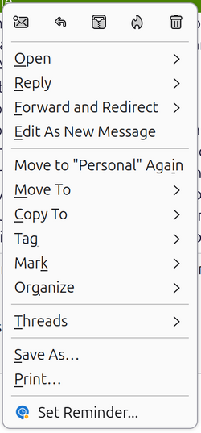
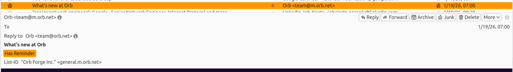
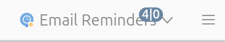
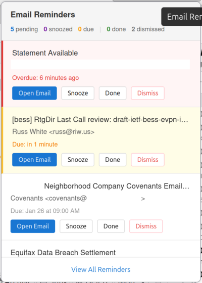
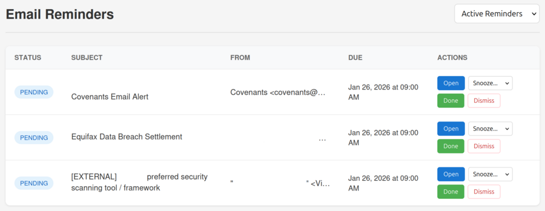
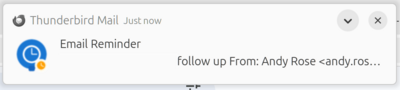
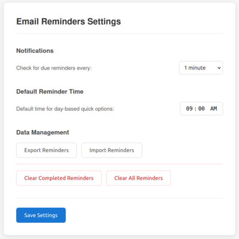

# Email Reminders for Thunderbird

A Thunderbird extension that adds Outlook-style email reminders. Set reminders on any email and receive notifications when they're due.


## Features

- **Set reminders** on any email via right-click context menu
- **Quick options** - In 1 hour, 4 hours, Tomorrow, Next week
- **Custom date/time** picker for precise scheduling
- **Visual tags** - Emails with reminders show an orange "Has Reminder" tag in the message list
- **System notifications** when reminders are due
- **Snooze** reminders (5 min, 15 min, 1 hour, 4 hours, 1 day, 1 week)
- **Mark complete** or **dismiss** reminders
- **Add notes** to remind yourself why
- **View all reminders** with filtering (Active, Completed, Dismissed)
- **Export/Import** reminders as JSON backup
- **100% local** - No data leaves your computer

## Screenshots

### Setting a Reminder

Right-click any email in your message list and select **"Set Reminder..."** to open the reminder dialog.



Choose from quick options (1 hour, 4 hours, Tomorrow, Next Week) or set a custom date and time. Add optional notes to remind yourself why.


### Visual Tags on Emails

Emails with active reminders automatically display an orange **"Has Reminder"** tag in the message list and message header. The tag is removed when you complete or dismiss the reminder.



**Tip:** Enable the "Tags" column in your message list (right-click column headers) to see tags directly in the list view.

### Toolbar Popup

Click the **Email Reminders** toolbar button to see your active reminders at a glance. The badge shows two numbers: **pending|due** (blue for pending, orange when reminders are due).



Reminders are color-coded by urgency:
- **Red** - Overdue reminders
- **Yellow** - Due within the next hour
- **White** - Future reminders



### Full Reminder List

Click **"View All Reminders"** for the complete list with filtering options (Active, Completed, Dismissed).



### Notifications

When a reminder is due, you'll receive a system notification. Click the notification to open the email.



### Settings

Access settings via **Tools > Add-ons and Themes > Email Reminders > Options** to export, import, or manage your reminder data.



## Installation

### From Thunderbird Add-ons (Recommended)

1. Open Thunderbird
2. Go to **Tools** > **Add-ons and Themes**
3. Search for "**Email Reminders**"
4. Click **Add to Thunderbird**

Or visit: [Email Reminders on Thunderbird Add-ons](https://addons.thunderbird.net/en-US/thunderbird/addon/email-reminders/)

### Manual Installation

1. Download the latest `.xpi` file from [Releases](../../releases)
2. Open Thunderbird
3. Go to **Tools** > **Add-ons and Themes**
4. Click the gear icon (⚙️) > **Install Add-on From File...**
5. Select the downloaded `.xpi` file
6. Click **Add** when prompted

### Development Installation

1. Clone this repository:
   ```bash
   git clone https://github.com/gitzone83/thunderbird-reminder-extension.git
   ```
2. Open Thunderbird
3. Go to **Tools** > **Add-ons and Themes** > gear icon > **Debug Add-ons**
4. Click **Load Temporary Add-on...**
5. Select the `manifest.json` file from the cloned folder

## Usage

### Setting a Reminder

1. Right-click on any email in your message list
2. Select **Set Reminder...** from the context menu
3. Choose a quick option or select a custom date/time
4. Optionally add notes
5. Click **Set Reminder**

### Managing Reminders

- Click the **Email Reminders** icon in the toolbar to see active reminders
- Use **Snooze**, **Done**, or **Dismiss** to manage each reminder
- Click **View All Reminders** for the full list with filters

### Settings

Access via **Tools** > **Add-ons and Themes** > **Email Reminders** > **Options**

- Configure check interval
- Set default reminder time
- Export/Import reminders
- Clear reminder data

## Building from Source

```bash
# Clone the repository
git clone https://github.com/gitzone83/thunderbird-reminder-extension.git
cd thunderbird-reminder-extension

# Create XPI package
zip -r ../email-reminders.xpi * -x "*.git*" -x "*.md"
```

## Project Structure

```
thunderbird-reminder-extension/
├── manifest.json           # Extension manifest
├── background.js           # Background script (alarms, notifications)
├── popup/                  # Toolbar popup UI
├── reminder-dialog/        # Set reminder dialog
├── reminder-list/          # Full reminders list view
├── options/                # Settings page
├── icons/                  # Extension icons
├── _locales/               # Internationalization
├── README.md
├── PRIVACY.md
└── LICENSE
```

## Privacy

This extension stores all data locally on your device. No data is collected, transmitted, or shared with anyone. See [PRIVACY.md](PRIVACY.md) for details.

## Contributing

Contributions are welcome! Please feel free to submit a Pull Request.

1. Fork the repository
2. Create your feature branch (`git checkout -b feature/amazing-feature`)
3. Commit your changes (`git commit -m 'Add some amazing feature'`)
4. Push to the branch (`git push origin feature/amazing-feature`)
5. Open a Pull Request

## Roadmap

- [x] Visual indicators on emails with active reminders
- [ ] Recurring reminders
- [ ] Calendar integration
- [ ] Keyboard shortcuts
- [ ] More localization options

## License

This project is licensed under the MIT License - see the [LICENSE](LICENSE) file for details.

## Acknowledgments

- Inspired by Microsoft Outlook's email reminder functionality
- Built with [Thunderbird MailExtensions API](https://webextension-api.thunderbird.net/)
